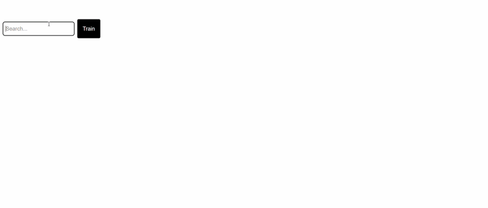

# TradingCast
 
A full-stack stock analysis platform that visualizes market data, predicts future price movements using machine learning, and helps users make informed buy or sell decisions.
 

 
---
 
## Features
 
### Chart
Visualize stock price history with technical indicators including Moving Average and RSI to identify market trends.
 

 
### Analyze
Analyze historical stock data and predict future price movements using machine learning. Add supporting stocks to improve model training and get detailed performance metrics including accuracy to help inform your buy or sell decisions.
 

 
### Download
Download and export historical stock data to a CSV file for offline analysis and research.
 

 
### Correlation
Measure how closely a stock's daily price changes move in sync with others to identify patterns and build a more diversified portfolio.
 

 
---
 
## Tech Stack
 
| Layer | Technology |
|-------|------------|
| Frontend | React, Next.js, Tailwind CSS |
| Backend | Python, FastAPI|
| Machine Learning | scikit-learn, TensorFlow |
| Data | yfinance |
| Charts | AG Charts |
 
---
 
## Getting Started
 
### Installation
 
**1. Clone the repository**
```bash
git clone https://github.com/YOUR_USERNAME/trading-cast.git
cd tradingcast
```
 
**2. Install frontend dependencies**
```bash
cd trading-cast-next
npm install
npm run dev
```
 
**3. Install backend dependencies**
```bash
cd server
cd app
pip install -r requirements.txt
uvicorn main:app --host 0.0.0.0 --port 8000
```
 
**4. Open the app**
 
Navigate to `http://localhost:3000` in your browser.
 
---
